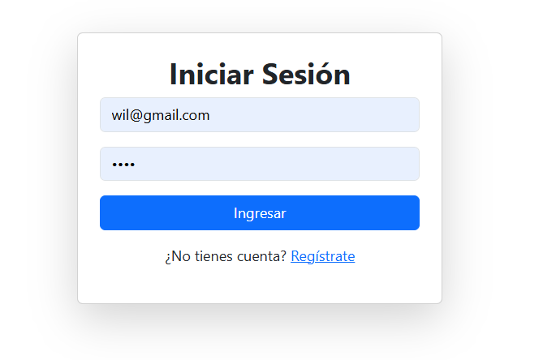
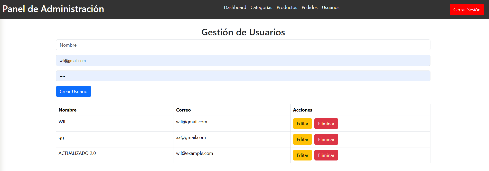
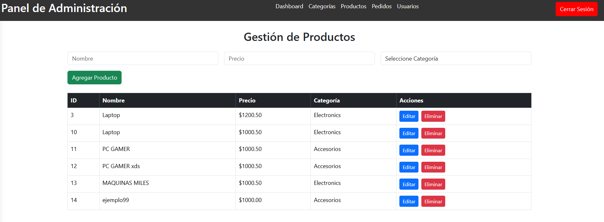
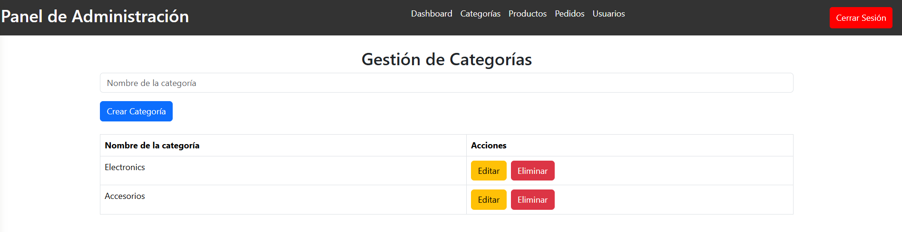

# VISTAS DEL FRONTEND
### Ejecutar con
```
npm run serve
```

### ejecucion de la base de datos




### Interfaces


### Lista de usuarios 



### Lista de productos



### Lista de categoria



### Lista de pedidos


